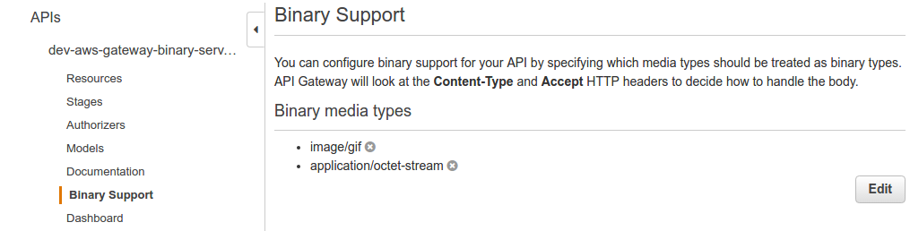
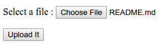

# AWS Gateway Binary

Example showing binary data responses and requests.

## Installation & Deployment

```bash
git clone https://github.com/bbilger/jrestless-examples.git
cd jrestless-examples
./gradlew build
cd aws/gateway/aws-gateway-binary
serverless deploy
serverless logs -f "api" -t # if you want to tail the logs
```

Since it's not yet possible in `serverless` or rather `CloudFormation` to set binary media types, they must be set manually.

Open the AWS console, go to the API Gateway page, add the binary media types `image/gif`, `application/octet-stream` and `multipart/form-data`, and save.



Once done you have to re-deploy the API to the dev stage, again.


Note: It may take a few seconds for the changed settings to get applied.


```bash
curl -v --header "Accept: image/gif" .../dev/api/cat-input-stream > cat.gif
curl -v --header "Accept: image/gif" .../dev/api/cat-byte-array > cat.gif
curl -v --header "Accept: image/gif" .../dev/api/cat-streaming-output > cat.gif
curl -v --header "Accept: image/gif" .../dev/api/cat-data-source > cat.gif
curl -v --header "Accept: image/gif" .../dev/api/cat-file > cat.gif
curl -v --header "Accept: application/octet-stream" --header "Content-Type: application/octet-stream" --request POST --data-binary "@cat.gif" .../dev/api/binary > cat_from_server.gif
```

`.../ui/upload` can be opened in a browser to upload a file via a form to `.../api/upload`.




## Endpoints

|Endpoints                   |Method|Consumes                |Produces                 | Status Code    | Comment
|----------------------------|------|---------               |----------               |----------------|---
|api/cat-input-stream        |GET   |-                       |image/gif                |200             | endpoint's response type is an InputStream
|api/cat-byte-array          |GET   |-                       |image/gif                |200             | endpoint's response type is a byte array
|api/cat-streaming-output    |GET   |-                       |image/gif                |200             | endpoint's response type is a StreamingOutput
|api/cat-data-source         |GET   |-                       |image/gif                |200             | endpoint's response type is a DataSource
|api/cat-file                |GET   |-                       |image/gif                |200             | endpoint's response type is a File
|api/binary                  |POST  |application/octet-stream|application/octet-stream |200             | responds with the posted data
|ui/upload                   |GET   |                        |text/html                |200             | simple form to upload a file to api/upload
|api/upload                  |POST  |multipart/form-data     |                         |204             | processes an uploaded file and logs the file name and contents
