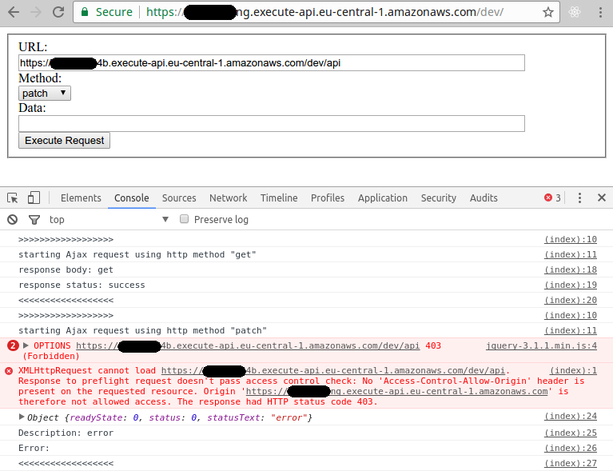
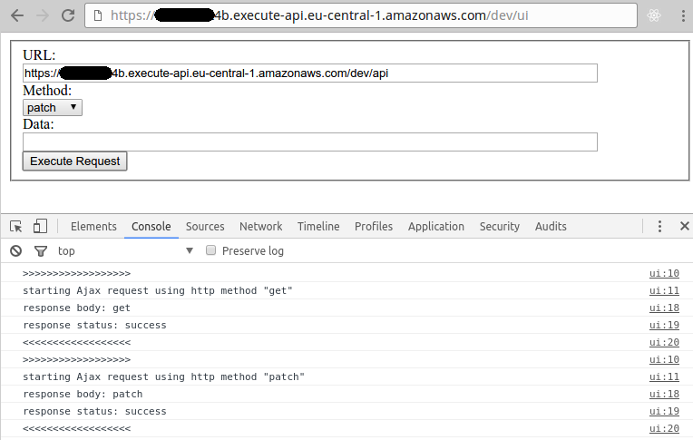

# AWS API Gateway Usage Example

The CORS example consists of a backend and a frontend service in order to showcase `com.jrestless.core.filter.cors.CorsFilter` and so CORS requests.

## Installation & Deployment

```bash
git clone https://github.com/bbilger/jrestless-examples.git
cd jrestless-examples
./gradlew build
cd aws/gateway/aws-gateway-cors-frontend
serverless deploy
cd ../aws-gateway-cors-backend
serverless deploy
```

Make a note of the frontend and backend endpoints.

## Usage

For this example, we assume the following endpoints:

```bash
Service Information
service: aws-gateway-cors-frontend-service
stage: dev
region: eu-central-1
api keys:
  None
endpoints:
  ANY - https://...ng.execute-api.eu-central-1.amazonaws.com/dev/
```

```bash
Service Information
service: aws-gateway-cors-backend-service
stage: dev
region: eu-central-1
api keys:
  None
endpoints:
  ANY - https://...4b.execute-api.eu-central-1.amazonaws.com/dev/api
  ANY - https://...4b.execute-api.eu-central-1.amazonaws.com/dev/ui
```

Open the frontend's form at `https://...ng.execute-api.eu-central-1.amazonaws.com/dev/` and enter the backend URL `https://...4b.execute-api.eu-central-1.amazonaws.com/dev/api`. The CORS filter registered in the backend will allow all methods but "PATCH" from any origin.



The backend comes with the same form in order to show that same origin requests bypass the CORS filter.



## Backend Endpoints

|Endpoints                   |Method                              |Consumes|Produces  | Comment
|----------------------------|------------------------------------|--------|----------|---------
|/api                        |GET,POST,PUT,DELETE,OPTIONS,PATCH   |-       |text      | the CORS filter allows Ajax requests for all methods but PATCH from any origin
|/ui                         |GET                                 |-       |HTML      | the backend comes with the same form in order to showcase that the CORS filter is bypassed for same origin requests

## Frontend Endpoints

|Endpoints                   |Method                              |Consumes|Produces  | Comment
|----------------------------|------------------------------------|--------|----------|---------
|/                           |GET                                 |-       |HTML      | form to perform Ajax requests to the backend
