# AWS API Gateway Cognito User Pool Authorizer

Example showing the integration of a cognito user pool authorizer.

## Cognito User Pool Creation

Since a cognito user pool cannot be created with serverless or rather CloudFormation, one has to be created manually.

Open the AWS console, go to "Cognito", hit "Manage your User Pools" and hit "Create a User Pool".

Choose a pool name and hit "Review defaults".

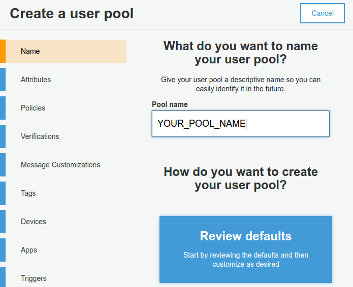

Leave the default settings and hit "Create pool".

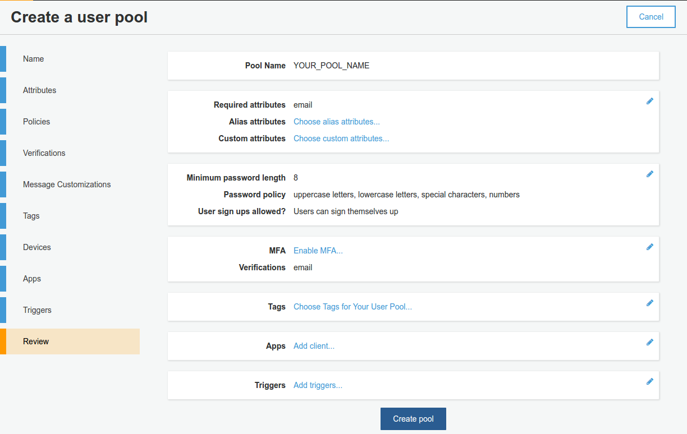

Next a new app must be configured, so select the "Apps" tab.

Choose a name, **make sure to de-select "Generate client secret"** and hit "Create app".

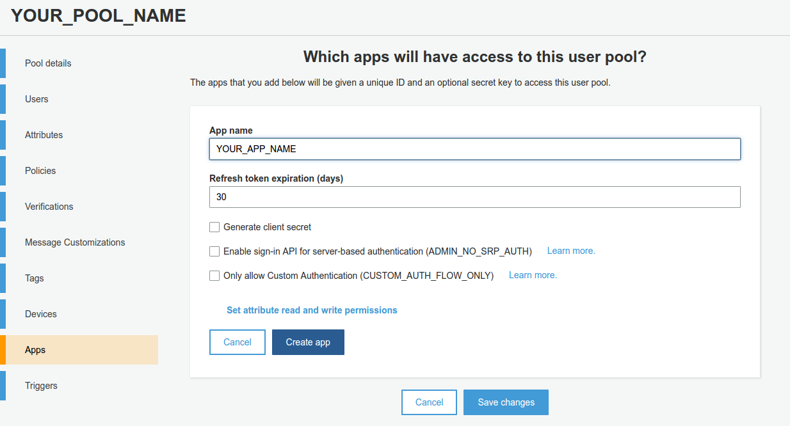

Make a note of the "App client id"

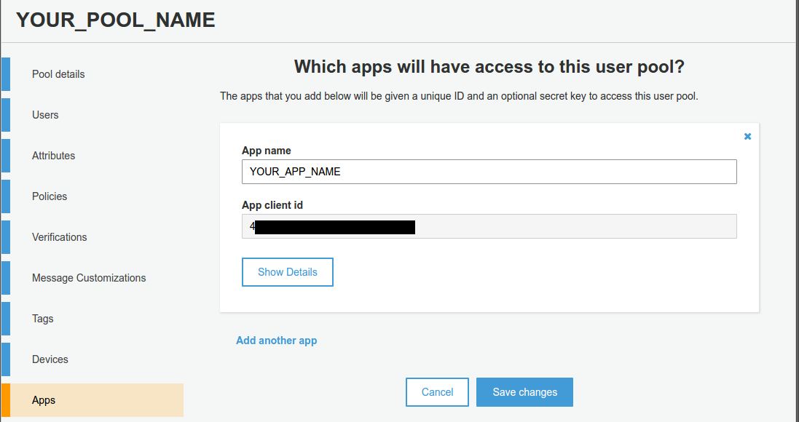

Select the "Pool details" tab and make a note on the user pool id.

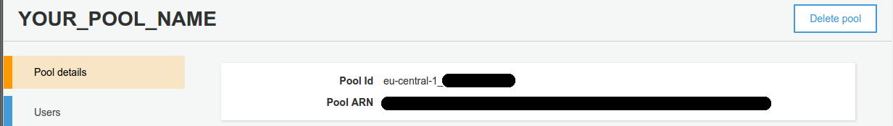


## Installation & Deployment

```bash
git clone https://github.com/bbilger/jrestless-examples.git
cd jrestless-examples
./gradlew build
cd aws/gateway/aws-gateway-security-cognito-authorizer
cp cognitoUserPoolSettings.yml.sample cognitoUserPoolSettings.yml
# replace "YOUR_USER_POOL_ID" with your actual user pool id
sed -i 's/YOUR_USER_POOL_ID/<yourActualUserPoolId>/g' cognitoUserPoolSettings.yml
# replace "YOUR_CLIENT_ID" with your actual client id
sed -i 's/YOUR_CLIENT_ID/<yourActualClientId>/g' cognitoUserPoolSettings.yml
serverless deploy
```

### Create the Cognito Authorizer

Since there's no way in serverless, to create a cognito authorizer, yet, this has to be done manually.

Open the AWS console, go to API Gateway, select the API "dev-aws-gateway-security-cognito-authorizer-service", select "Authorizers" and create a new "Cognito User Pool Authorizer".

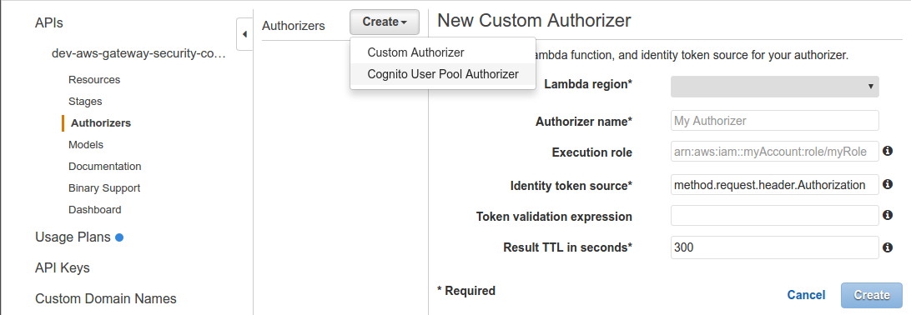

Select the previously created or existing "Cognito User Pool" and hit create.

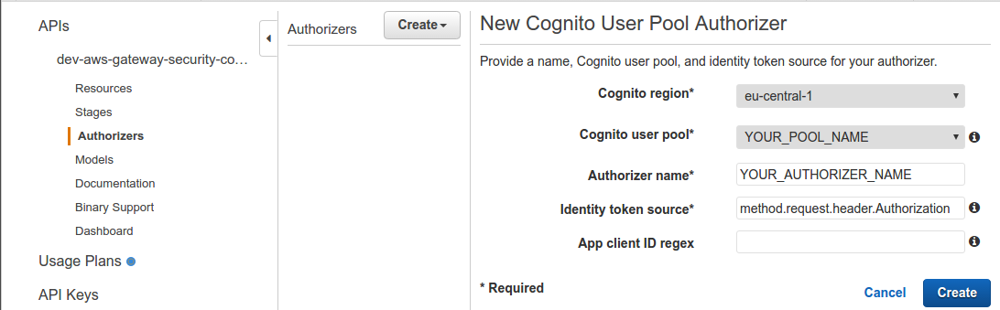

### Register the Cognito Authorizer

Go to "Resources", select "/" -> "/api" -> "/private" -> "GET" and click on "Method Request".

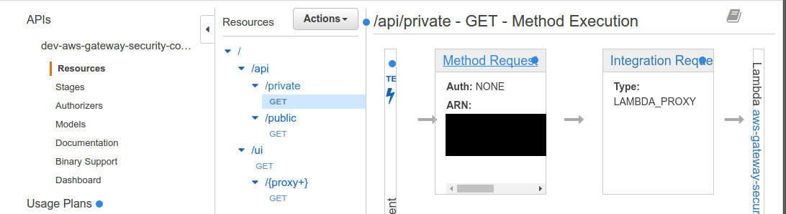

Select the previously created "Cognito user pool authorizers", e.g. "YOUR_AUTHORIZER_NAME" and confirm the change.

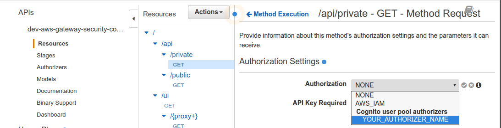

### Redeploy the API

To apply the changes, the API must be re-deployed.

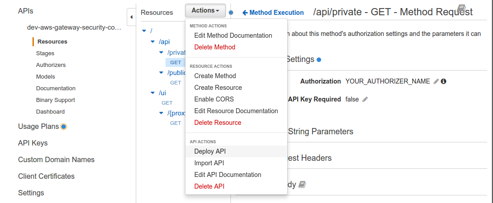

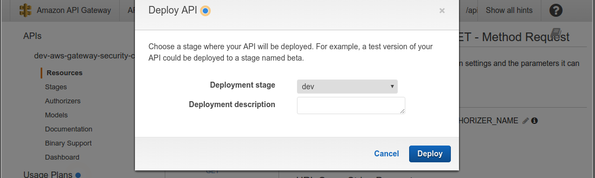

## UI

The example includes a minimal UI with forms to sign up (enter a valid email since the confirmation code is required), confirm the account and login. On successful login the ID token can be used to make requests to the private API endpoint (api/private).

The site can be accessed via .../ui.

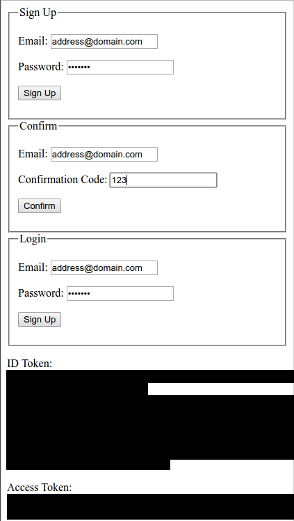

## Endpoints

|Endpoints                   |Method|Consumes |Produces  | Status Code    | Comment
|----------------------------|------|---------|----------|----------------|---
|api/private                 |GET   |-        | JSON     |200, 401        | Authorization header set to a valid ID token => 200; else 401
|api/public                  |GET   |-        | JSON     |200             | no principal injected even if the ID token is given in the Authorization header since the authorizer won't get invoked
|ui                          |GET   |-        | HTML     |200             | ui to register, confirm and login
|ui/*                        |GET   |-        | HTML     |200             | a few JS resources we require and which aren't available via a CDN
