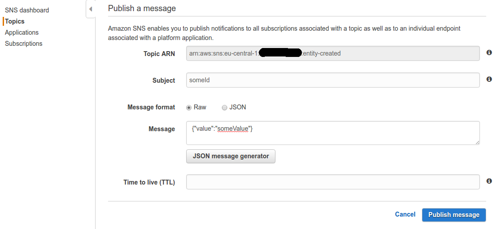
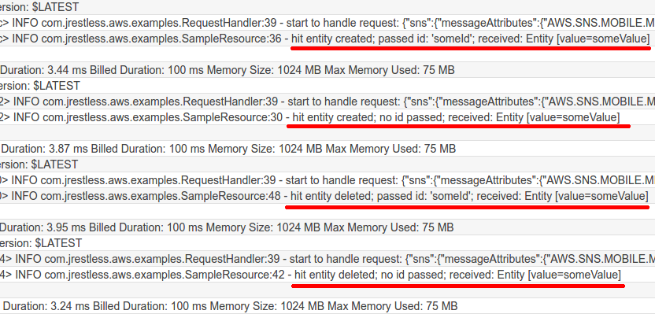

# AWS SNS Usage Example

SNS event handler example.

Note: Normally you would publish to SNS programmatically but in this example we will do it from the console.

## Installation & Deployment

```bash
git clone https://github.com/bbilger/jrestless-examples.git
cd jrestless-examples
./gradlew build
cd aws/sns/aws-sns-usage-example
serverless deploy
serverless logs -f "entityEvents" -t # if you want to tail the logs
```

After deployment go to the SNS page in the AWS console: <https://eu-central-1.console.aws.amazon.com/sns/v2/home?region=eu-central-1#/topics>.

Select the topic "entity-created" and publish the following message to it:



By default the SNS handler uses the topic name and the subject to construct the request URI. So in this case it will be "entity-created/someId". You can override this behavior in the handler if required.

After you published the message go to CloudWatch and check the logs for your function.



The logs are the result of publishing:

| Topic          | Subject       | Message
| ---            | ---           | ---
| created-entity | someId        | {"value": "someValue"}
| created-entity | &lt;none&gt;  | {"value": "someValue"}
| deleted-entity | someId        | {"value": "someValue"}
| deleted-entity | &lt;none&gt;  | {"value": "someValue"}
